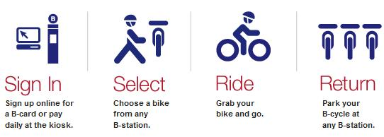
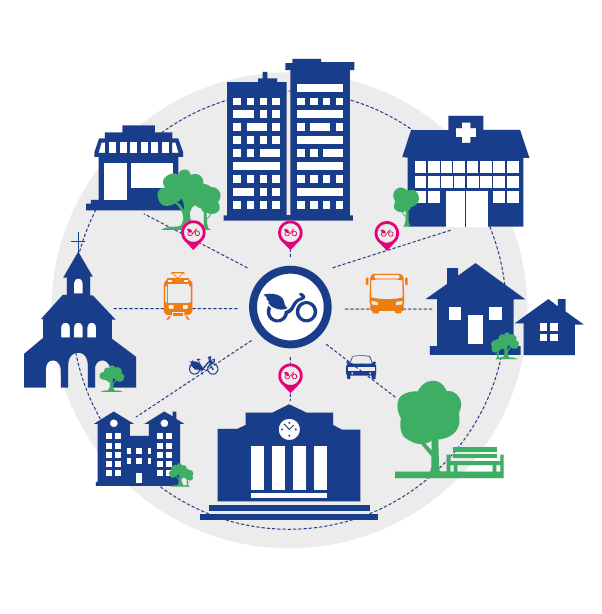

# eCycle | Rajasthan Hackathon 4.0

### Objective
A Cheap & effective Business model which has core aim is to provide quick and fast bicycle sharing on demand for travel the shortest distance inside Jaipur city, Rajasthan.

### Target Audiance
Business plan can be customisable as per targeted audiance
- **Education** (Students can use our service in college campus)
- **Tourist** (Tourist can use our service for short distance in tourist place like Abu etc)
- **Government and Private sector** (Any Government big office or high rised residential area)

### Digital Services that can adopt in our app
- **SSO login**
- **Rajdharaa for map**
- **RPP for payment**

### Release
This release includes on prototype version of our project. You can download apk [here](https://github.com/Bhavdip/ecycle/raw/master/releases/ecycle-app-debug.apk). 
